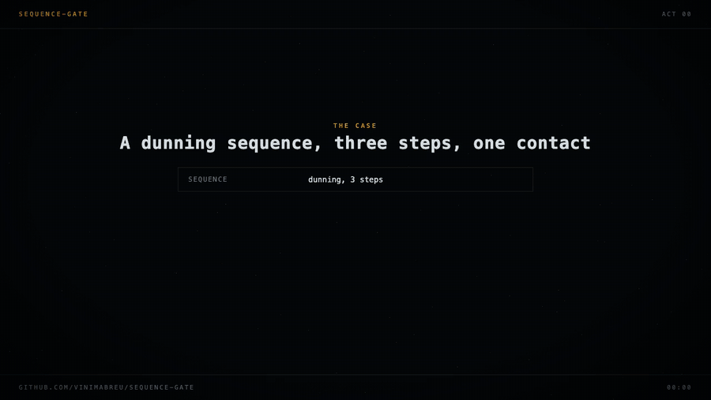
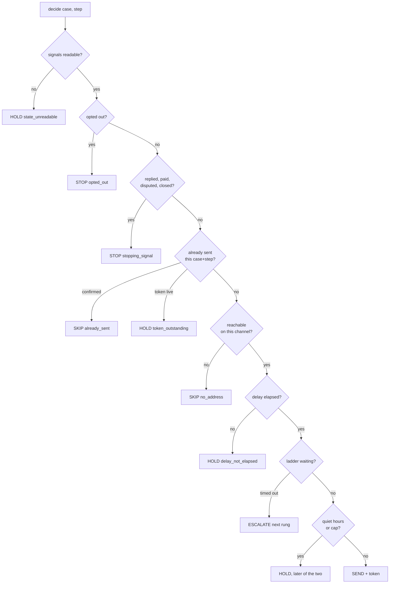

# sequence-gate

**Decide whether the next step of a follow-up sequence may fire.**




Every value in that animation comes out of `python examples/demo.py`, which runs the four
scenes against the real engine and prints what it decided.

Your n8n, Make or Zapier scenario already knows how to send a message. What it does not
know is whether it should. `sequence-gate` is the service it asks first.

```
POST /decide  {"case_id": "job-4417"}

{"kind": "stop", "reason": "stopping_signal",
 "detail": "replied at 2026-09-14T09:12:00+00:00",
 "evidence": {"signals_read": [{"type": "replied", "source": "whatsapp", ...}]}}
```

---

## The problem

Every follow-up sequence is the same three lines of business logic and the same five
ways of getting them wrong.

- Day 1 email, Day 3 SMS, Day 7 WhatsApp, **stop when they pay, dispute or opt out.**
- Send the job to the nearest supplier, **escalate to the next one if nobody accepts.**
- Text the lead within 60 seconds, then **follow up at intervals** until someone answers.

In a visual automation tool each of those is a handful of nodes and a wait. The nodes are
easy. What is not easy is that the wait is where the state goes stale: while the scenario
sleeps, the debtor pays, the supplier accepts, the lead replies, the contact texts STOP.
The next node wakes up holding a decision that was made before any of that happened.

Five failures follow from it, and every one of them is a real incident:

| Failure | What it looks like from outside |
|---|---|
| Stop checked after the send | Someone who replied on Tuesday gets chased on Wednesday |
| Idempotency keyed on the provider message id | A retried webhook sends the same message twice |
| Quiet hours on the server clock | A contact eight zones east gets an SMS at 03:12 |
| Caps scoped to one sequence | Two campaigns each obey their limit and together double it |
| An escalation ladder with no last rung | A case walks off the end and nobody ever sees it |

`sequence-gate` is the decision layer that refuses all five, and ships the wrong versions
alongside the right ones so the refusals are demonstrated rather than claimed.

## What it answers

| Verdict | Meaning | Carries |
|---|---|---|
| `SEND` | clear to fire | `send_token` to confirm with |
| `SKIP` | this step does not apply | the next step to try |
| `HOLD` | not yet | `retry_after` |
| `STOP` | the sequence is over | the signal that ended it |
| `ESCALATE` | nobody answered | the next target on the ladder |

Every verdict carries a `reason` and the `evidence` it read, so any message that went out
can be argued about afterwards with the facts that were true at the time.

## The rules it enforces

1. **Stop before send.** Stopping conditions are evaluated on every call, before anything
   else. A store that cannot answer returns `HOLD`, never `SEND`: an empty result reads as
   "nothing stopped this case", and that is exactly how a machine keeps texting someone
   who asked it to stop.
2. **Idempotency on (case, step).** Not on the provider's message id. That id identifies a
   delivery attempt, not the intent to contact this person about this step.
3. **Two-phase send.** The decision reserves the step and hands back a token; the caller
   confirms once the provider accepted. An unconfirmed token expires, so a provider outage
   does not freeze the case forever.
4. **Quiet hours in the contact's timezone**, including windows that cross midnight and the
   two days a year when a local wall time happens twice or not at all.
5. **Frequency caps across sequences.** Counted per contact and channel over a sliding
   window, spanning every sequence that contact is in.
6. **Bounded escalation ending in a person.** A ladder whose last rung is not a human
   handoff is refused when the config is loaded, not discovered at 3am.
7. **Consent is absolute.** An opt-out is contact-scoped, instant, and outlives every
   sequence.
8. **Append-only audit.** Every decision is recorded with its inputs, its reason and the
   signals it read.

## Decision flow



## Quick start

```python
from datetime import datetime, timedelta, timezone
from sequence_gate import (
    Case, Channel, Contact, QuietHours, Sequence, SequenceGate, Step, SystemClock,
    InMemoryAuditLog, InMemoryCaseStore, InMemorySendLedger, InMemorySignalStore,
)

contact = Contact(
    contact_id="c-1",
    timezone="Asia/Kolkata",
    addresses={Channel.SMS: "+915550000000"},
    quiet_hours=QuietHours(start_hour=21, end_hour=8),
)
sequence = Sequence(
    sequence_id="dunning",
    steps=(
        Step(step_id="s1", channel=Channel.SMS, content_ref="tpl.first"),
        Step(step_id="s2", channel=Channel.SMS,
             delay_after_previous=timedelta(days=3), content_ref="tpl.second"),
    ),
)
case = Case(case_id="k-1", sequence_id="dunning", contact_id="c-1",
            started_at=datetime.now(timezone.utc))

ledger = InMemorySendLedger()
ledger.bind_case_to_contact("k-1", "c-1")

gate = SequenceGate(
    clock=SystemClock(),
    cases=InMemoryCaseStore([case], [contact]),
    sequences={"dunning": sequence},
    signals=InMemorySignalStore(),
    ledger=ledger,
    audit=InMemoryAuditLog(),
)

verdict = gate.advance("k-1")
if verdict.kind.value == "send":
    ...                                   # your workflow sends it
    gate.confirm(verdict.send_token, provider_message_id="SM123")
```

Every store above is a Protocol. Back them with Postgres, Redis or a Sheet and the
decision logic does not change.

## HTTP

```bash
pip install "sequence-gate[service]"
```

| Route | Purpose |
|---|---|
| `POST /decide` | `{case_id}` for the next step, or `{case_id, step_id}` for one |
| `POST /signals` | record a reply, payment, dispute, opt-out or bounce |
| `POST /sends` | confirm what the provider did with the token |
| `GET /audit/{case_id}` | the decision trail |

`integrations/n8n-follow-up.json` is an importable workflow wired to those routes:
cron, decide, switch on the verdict, send, confirm.

## What this is not

- **Not a sender.** It never talks to Twilio, WhatsApp, SendGrid or a print API.
- **Not a scheduler.** It owns no queue and no cron. The caller asks.
- **Not a CRM.** It holds the state of the sequence, not the state of the business.

That boundary is deliberate. Replacing the orchestration tool a team already uses is a
much bigger ask than being the thing it calls.

## Bugs found while building it

Kept here because they are the useful part of a repository like this.

1. **The frequency cap told callers to retry at an instant that was still capped.**
   `retry_after` was computed as `oldest_send + window` while the window counted sends
   with `>=`, so a caller that obeyed the retry time was held again, forever. The window
   is half-open now, and a test pins the boundary.
2. **`sequence_exhausted` was declared and never produced.** A hygiene test that asserts
   every reason in the vocabulary is reachable from the engine caught it, which is how
   `advance()` came to exist: nothing was answering "the sequence is over".

## Tests

```bash
pip install -e ".[dev]"
python -m pytest
```

138 tests, no network, no sleeps, and a clock that only moves when a test moves it.
Three deliberately wrong implementations live in `src/sequence_gate/wrong.py` and are run
by `tests/test_wrong_implementations.py`, which fails if anyone ever fixes them.

---

Vinicius Pereira
[vinimabreu.dev](https://vinimabreu.dev) · [github.com/vinimabreu](https://github.com/vinimabreu)
